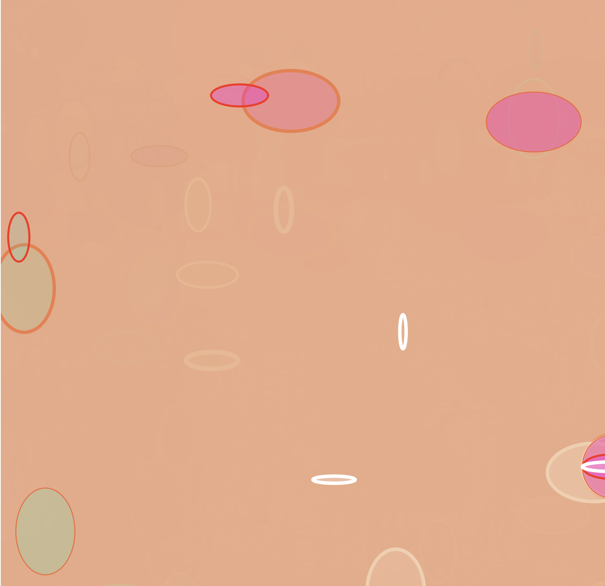

# Week 1 ## — Introduction to Creative Coding

---

### Activities

| Activity | What I Made                   |
| -------- | ----------------------------- |
| `1a`     | Created a simple creature using basic shapes, colours, and a background in p5.js. |
| `1b`     | Modified a provided sketch using random(), mouseX, and mouseY to create an interactive visual. |

---

### This Week

This week was my introduction to creative coding and p5.js. For Activity 1a, I experimented with basic shapes and colours to create a simple creature and learned how setup() and draw() work together to create a composition.

For Activity 1b, I started experimenting with interaction by using mouseX, mouseY, and random() to make the elements respond to my mouse movement. It was interesting to see how some simple coding changes could make an interaction feel more dynamic and unpredictable. This sparked my curiosity that coding can be used to create movement and interaction.

---

### Output

activity1a-image01
<!-- Drop a screenshot, photo, or GIF of something you made this week.
     Save it to a readme-assets/ folder inside this week's folder.
     Made more than one thing worth showing? Add more images. -->

---
