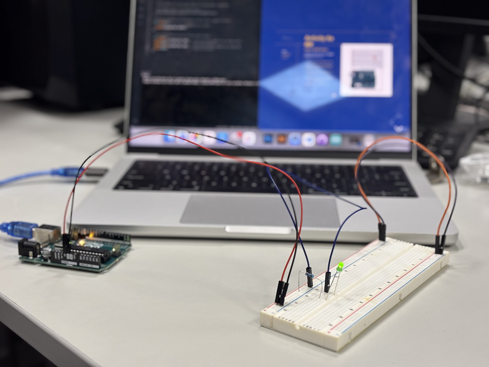
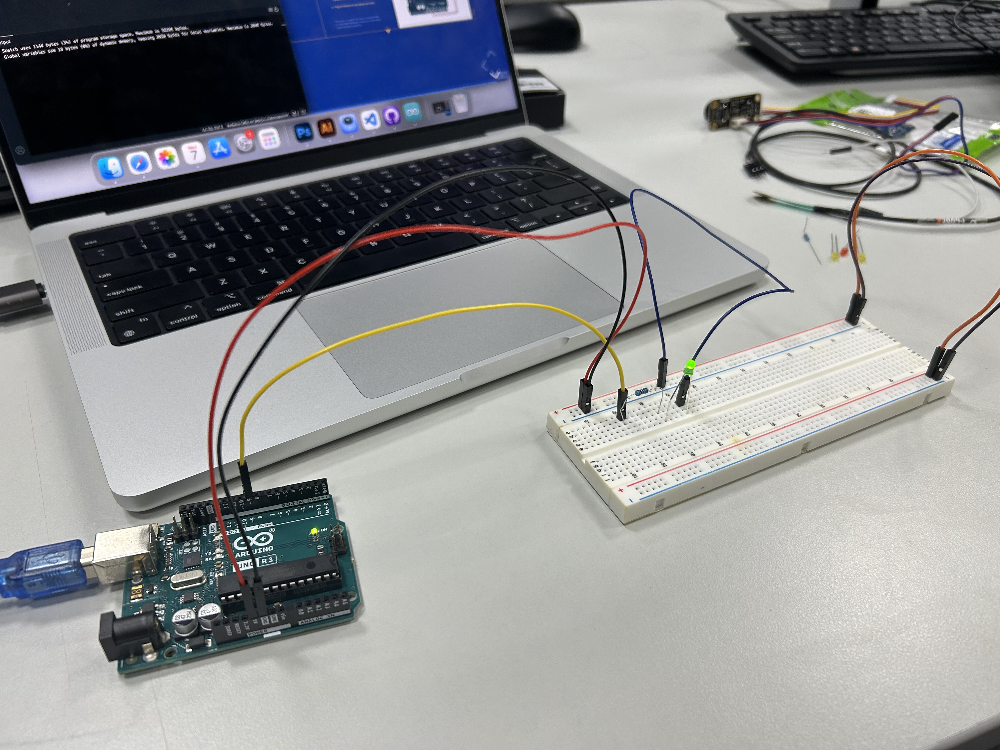
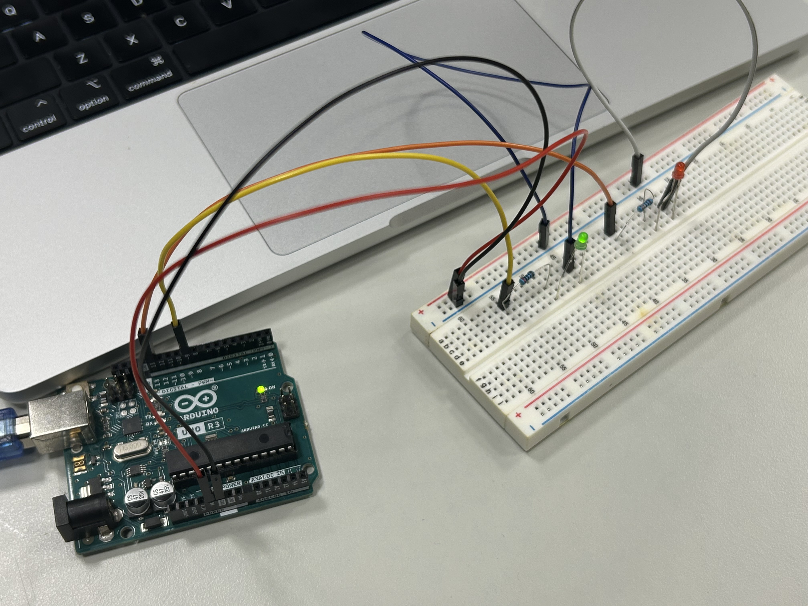
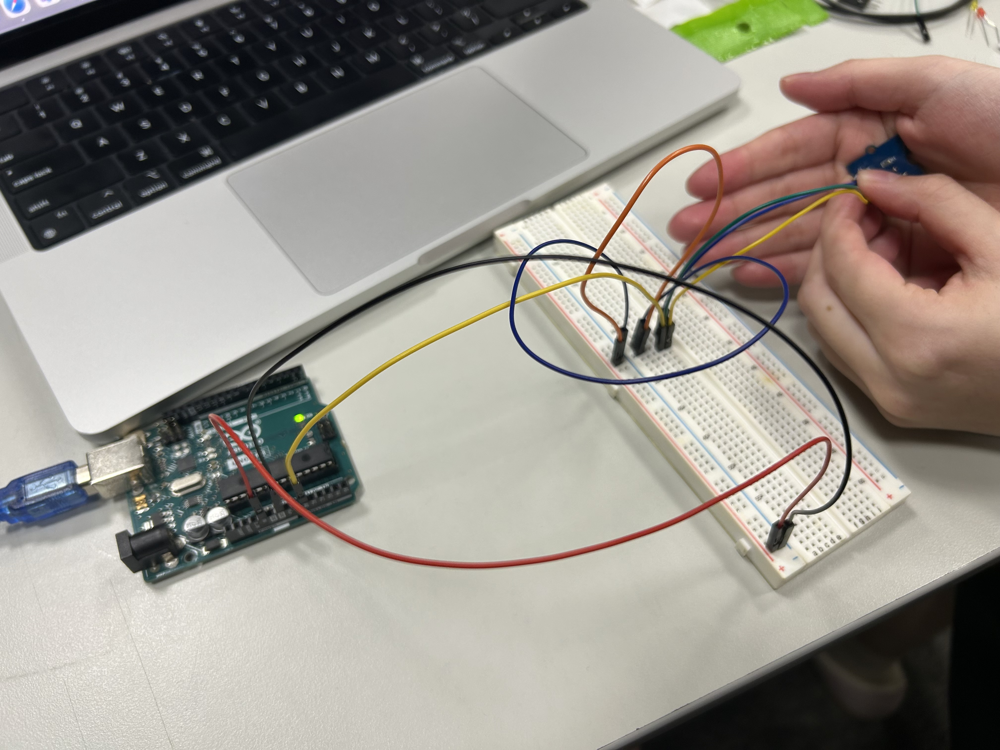
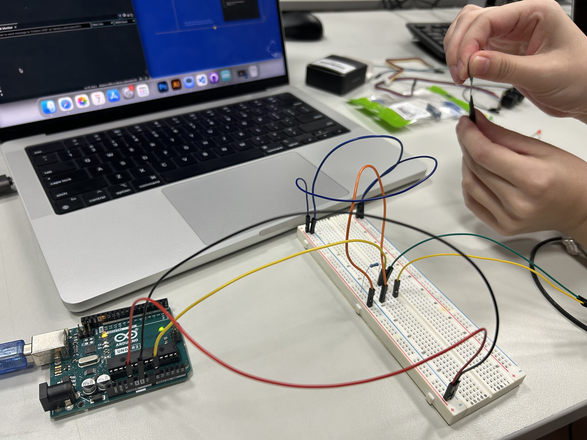
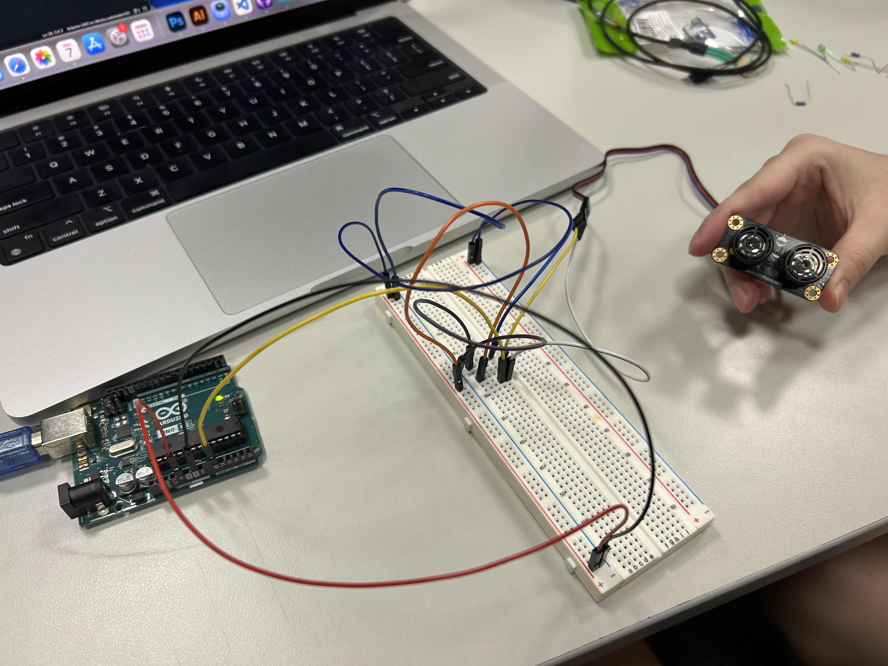

# Week8 ## — Arduino Basics

---

### Activities

| Activity | What I Made                   |
| -------- | ----------------------------- |
| `8a`     | Experiment with the led in arduino to learn simple control, like consistant light on, fade control and combination of two functions |
| `8b`     | Experiment with different sensor in arduino, like phototransistor sensor, force sensor and ultrasonic sensor |

---

### This Week

Activity 5a — Light it Up
 - I explored the basic function of controlling led 
 - Learned to connect the wires properly and got familiar with the arduino IDE interface.
 - It feels cool to see the code on the screen become the physical interaction on the led light.

Activity 8b — Sensor Check
 - I experimented with different sensor and play with them to see how they function.
 - It is interesting to see the sensor show certain statistics in the monitor and it continuously changing when moving or pressing.
 - It needs to be careful when connecting the wires since it is more complicated than the led pratice.

---

### Output

---

<!-- ─────────────────────────────────────────────────────
     GOING FURTHER — if you want to document more, here are some ideas:

     ### 8a — Light it Up

     ### 🧩 Something I Found Interesting
     In the combination challenge, we change the delay for the Blink LED part and we find that it will also affect the Fade LED part, resulting in LED fade slower than original. 

      void loop() {
       // Blink LED
       digitalWrite(blinkLED, HIGH);
       delay(1000);
       digitalWrite(blinkLED, LOW);
       delay(1000);
       digitalWrite(blinkLED, HIGH);
       delay(100);
       digitalWrite(blinkLED, LOW);
       delay(100);

       // Fade LED
       analogWrite(fadeLED, brightness);
       brightness += fadeAmount;

       // Reverse direction at brightness limits
       if (brightness <= 0 || brightness >= 255) {
         fadeAmount = -fadeAmount;
       }

       delay(30);
     }
     ───────────────────────────────────────────────────── -->
